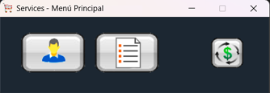
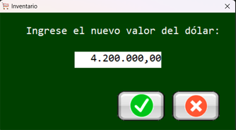
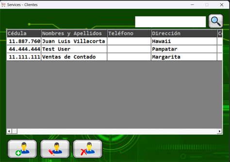
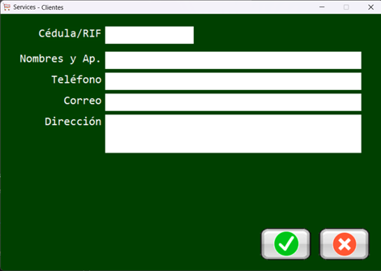
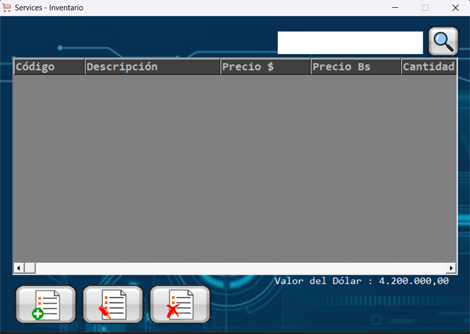
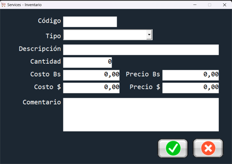

### 🛒 Shopping Cart Software - Version 1.0 (Legacy VB6)

[Español](#español) | [English](#english) 

### Español

### 🌟 Acerca del Proyecto

Este repositorio resguarda la **Versión 1.0** de **Shopping Cart Software**, un sistema de escritorio integral desarrollado originalmente en **Visual Basic 6 (VB6)** para la gestión y administración de negocios de servicios. 

Este software representa la base fundacional de lógica de negocio y arquitectura de datos que dio origen a la posterior migración hacia una aplicación web moderna (PHP/MySQL). 

### 🛠️ Características y Módulos Implementados

* **Gestión de Ventas y Carrito:** Módulo para la captura de servicios, cálculo de totales, impuestos y procesamiento de órdenes de compra en tiempo real.
* **Control de Inventario de Servicios:** Registro y parametrización de servicios ofrecidos, categorías y asignación de costos fijos.
* **Interfaz de Usuario Clásica (MDI):** Diseño basado en ventanas múltiples (MDI Forms) con menús dinámicos para una navegación administrativa ágil y cómoda en sistemas Windows.
* **Persistencia de Datos de Negocio:** Estructura optimizada para el almacenamiento seguro de transacciones, registros de clientes y bitácoras de ventas.

### 🚀 Cómo Ejecutar esta Versión

1. Requiere el entorno de desarrollo clásico de **Visual Studio 6.0 / Visual Basic 6** en un sistema Windows compatible.
2. Abre el archivo principal de proyecto .VBP.
3. Presiona F5 para compilar e iniciar el sistema de gestión en modo de depuración.

### English

### 🌟 About the Project

This repository preserves **Version 1.0** of **Shopping Cart Software**, a comprehensive desktop management system originally developed in **Visual Basic 6 (VB6)** tailored for service-based businesses. 

This legacy software serves as the foundational pillar for the core business logic and data schema that would later inspire and drive the migration toward a modern web application (PHP/MySQL). 

### 🛠️ Core Features & Modules

* **Sales & Cart Management:** High-fidelity module for service cataloging, automated subtotal/tax calculations, and real-time checkout processing.
* **Service Inventory Control:** Structured data tracking for active services, cost allocation, and category grouping.
* **Classic Desktop UI (MDI):** Layout utilizing Multiple Document Interface (MDI) forms and custom menus optimized for fast-paced administrative workflows on Windows.
* **Business Data Persistence:** Reliable local data storage handling user transactions, client indexing, and operational logs.

### 🚀 How to Run This Version

1. Requires a classic **Visual Studio 6.0 / Visual Basic 6** IDE installation on a compatible Windows environment.
2. Load the main .VBP project file.
3. Hit F5 to compile and execute the desktop management suite.

*Fase inicial y cimiento de un sistema actualmente modernizado hacia la web.*